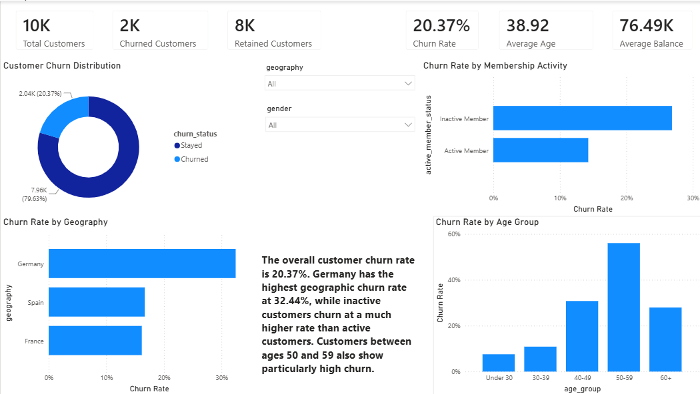
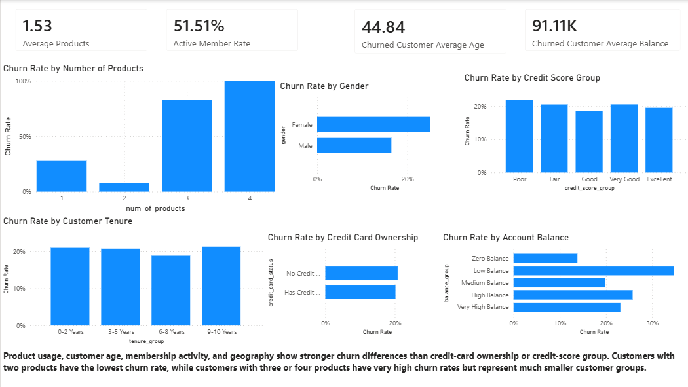
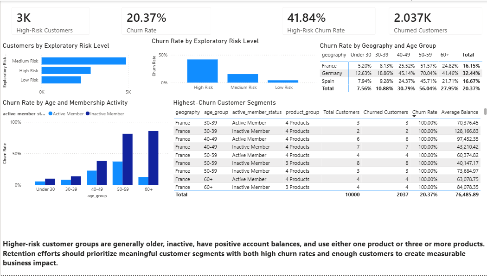

# Bank Customer Churn and Retention Analysis

## Project Overview

This project analyzes bank customer churn to identify customer characteristics associated with higher churn and provide data-driven recommendations for improving customer retention.

I used Python and pandas to clean, validate, and explore the customer data. PostgreSQL and SQL were used for structured analysis, customer segmentation, churn comparisons, and advanced analytical queries. Power BI was used to build an interactive three-page dashboard that presents the main findings and retention opportunities.

The project follows an end-to-end data analysis workflow:

1. Data collection and review
2. Data validation and cleaning
3. Exploratory data analysis
4. SQL-based business analysis
5. Customer segmentation
6. Power BI dashboard development
7. Business insight and recommendation documentation

---

## Business Problem

Customer churn can reduce revenue, customer lifetime value, and long-term business growth. Retaining existing customers is often an important part of maintaining stable business performance.

The goal of this project was to answer the following questions:

- What is the overall customer churn rate?
- Which geographic markets have the highest churn?
- How does customer age relate to churn?
- Are inactive customers more likely to leave?
- How does the number of products used relate to churn?
- Are customers with higher account balances more likely to churn?
- Does customer gender show meaningful differences in churn?
- How strongly are credit score, tenure, and credit-card ownership associated with churn?
- Which customer groups should receive greater retention attention?

---

## Tools and Technologies

- **Python** — data cleaning and exploratory analysis
- **pandas** — data manipulation, validation, grouping, and aggregation
- **NumPy** — numerical analysis
- **Matplotlib** — exploratory data visualization
- **Jupyter Notebook** — Python analysis workflow
- **PostgreSQL** — database storage and analysis
- **SQL** — validation, segmentation, KPI calculations, and advanced analysis
- **Power BI** — dashboard development and business reporting
- **DAX** — dashboard measures and calculated columns
- **Git and GitHub** — version control and project documentation

---

## Dataset

The project uses the Bank Customer Churn Modelling dataset.

The dataset contains:

- **10,000 customer records**
- **14 original columns**
- Customer demographic information
- Account information
- Product usage information
- Customer activity information
- Churn status

### Original Dataset Columns

| Column | Description |
|---|---|
| `RowNumber` | Original row number |
| `CustomerId` | Unique customer identifier |
| `Surname` | Customer surname |
| `CreditScore` | Customer credit score |
| `Geography` | Customer country |
| `Gender` | Customer gender |
| `Age` | Customer age |
| `Tenure` | Number of years with the bank |
| `Balance` | Customer account balance |
| `NumOfProducts` | Number of bank products used |
| `HasCrCard` | Whether the customer owns a credit card |
| `IsActiveMember` | Whether the customer is an active member |
| `EstimatedSalary` | Estimated customer salary |
| `Exited` | Customer churn status |

### Churn Target

- `Exited = 0` — Customer stayed
- `Exited = 1` — Customer churned

---

## Repository Structure

```text
bank-customer-churn-analysis/
│
├── dashboard/
│   ├── data/
│   │   └── .gitkeep
│   │
│   └── screenshots/
│       ├── executive_overview.png
│       ├── churn_driver_analysis.png
│       └── customer_segments_retention.png
│
├── data/
│   ├── raw/
│   │   └── .gitkeep
│   │
│   └── cleaned/
│       └── .gitkeep
│
├── python/
│   └── 01_data_cleaning_and_eda.ipynb
│
├── sql/
│   ├── 01_create_table.sql
│   ├── 02_import_data.sql
│   ├── 03_phase_1_checks.sql
│   ├── 04_create_analysis_view.sql
│   ├── 05_core_churn_analysis.sql
│   ├── 06_advanced_churn_analysis.sql
│   └── 07_phase_3_summary_queries.sql
│
├── business_insights.md
├── executive_summary.md
├── README.md
├── requirements.txt
└── .gitignore
```

The raw and cleaned CSV files are excluded from the repository through `.gitignore`. Placeholder `.gitkeep` files are included so the folder structure remains visible on GitHub.

---

## Project Workflow

### Phase 1: Project and Database Setup

During the first phase, I:

- Created the project folder structure
- Added the dataset locally
- Created a PostgreSQL database
- Created the `bank_customers` table
- Imported the customer data into PostgreSQL
- Verified the dataset row count
- Reviewed customer, geography, gender, and churn distributions
- Checked basic numeric ranges
- Performed initial data validation

---

### Phase 2: Python Data Cleaning and Exploratory Analysis

Python and pandas were used to prepare the dataset for analysis.

The data-cleaning process included:

- Renaming columns using `snake_case`
- Reviewing data types
- Checking missing values
- Checking duplicate records
- Checking duplicate customer IDs
- Validating credit-score ranges
- Validating customer ages
- Validating tenure values
- Checking negative account balances
- Validating product counts
- Validating binary fields

No missing values or duplicate customer IDs were identified.

### New Analysis Columns

The following customer labels and groups were created:

- `churn_status`
- `credit_card_status`
- `active_member_status`
- `age_group`
- `credit_score_group`
- `balance_group`
- `salary_group`
- `tenure_group`
- `product_group`

### Customer Groups

#### Age Groups

- Under 30
- 30–39
- 40–49
- 50–59
- 60+

#### Credit Score Groups

- Poor
- Fair
- Good
- Very Good
- Excellent

#### Balance Groups

- Zero Balance
- Low Balance
- Medium Balance
- High Balance
- Very High Balance

#### Tenure Groups

- 0–2 Years
- 3–5 Years
- 6–8 Years
- 9–10 Years

#### Product Groups

- 1 Product
- 2 Products
- 3 Products
- 4 Products

The cleaned customer dataset was exported for SQL and Power BI analysis.

---

## SQL Analysis

An analysis-ready PostgreSQL view called:

```sql
vw_bank_customers_analysis
```

was created to provide consistent customer labels and segmentation groups.

### Core SQL Analysis

The core analysis included:

1. Executive customer and churn KPIs
2. Customer churn distribution
3. Churn by geography
4. Churn by gender
5. Churn by age group
6. Churn by active membership status
7. Churn by credit-card ownership
8. Churn by number of products
9. Churn by account-balance group
10. Churn by credit-score group
11. Churn by estimated-salary group
12. Churn by customer tenure
13. Churned versus retained customer profiles
14. Zero-balance versus positive-balance analysis
15. Churn by geography and gender
16. Churn by geography and membership activity
17. Churn by age and membership activity
18. Churn by product usage and membership activity
19. Churn by individual customer age
20. Multi-factor customer segment analysis

### Advanced SQL Analysis

Advanced SQL techniques included:

- Common table expressions
- Window functions
- `DENSE_RANK`
- `NTILE`
- Conditional aggregation
- Relative churn-risk comparison
- Balance quintile analysis
- Churn contribution analysis
- Multi-factor customer segmentation
- Exploratory rule-based risk scoring
- Retention-priority ranking

---

## Power BI Dashboard

The Power BI dashboard contains three pages.

---

### Page 1: Executive Overview

The Executive Overview summarizes the overall customer churn situation.

The page includes:

- Total customers
- Churned customers
- Retained customers
- Overall churn rate
- Average customer age
- Average customer balance
- Customer churn distribution
- Churn rate by geography
- Churn rate by membership activity
- Churn rate by age group
- Geography slicer
- Gender slicer



---

### Page 2: Churn Driver Analysis

The Churn Driver Analysis page compares churn across customer characteristics.

The page includes:

- Average number of products
- Active-member rate
- Average age of churned customers
- Average balance of churned customers
- Churn rate by number of products
- Churn rate by account-balance group
- Churn rate by gender
- Churn rate by credit-score group
- Churn rate by customer tenure
- Churn rate by credit-card ownership



---

### Page 3: Customer Segments and Retention

The Customer Segments and Retention page focuses on customer risk groups and retention priorities.

The page includes:

- High-risk customer count
- High-risk customer churn rate
- Overall churn rate
- Churned customer count
- Churn rate by exploratory risk level
- Customer count by exploratory risk level
- Churn by age and membership activity
- Churn by geography and age group
- High-churn customer segments



---

## Exploratory Customer Risk Score

A rule-based exploratory risk score was created using:

- Customer activity
- Customer age
- Number of products
- Account-balance status

The score groups customers into:

- Low Risk
- Medium Risk
- High Risk

The observed churn rates were approximately:

| Risk Level | Churn Rate |
|---|---:|
| Low Risk | 4.27% |
| Medium Risk | 15.37% |
| High Risk | 41.84% |

The high-risk group contained approximately 2,842 customers.

> The exploratory risk score is a descriptive segmentation method. It is not a machine-learning prediction model and should not be used operationally without additional validation.

---

## Key Findings

### Overall Churn

- Total customers: **10,000**
- Churned customers: **2,037**
- Retained customers: **7,963**
- Overall churn rate: **20.37%**
- Average customer age: **38.92**
- Average credit score: **650.53**
- Average account balance: **76,485.89**

Approximately one in five customers in the dataset left the bank.

---

### Geography

Germany had the highest customer churn rate.

| Geography | Churn Rate |
|---|---:|
| Germany | 32.44% |
| Spain | 16.67% |
| France | 16.15% |

Germany's churn rate was almost twice the rate observed in France and Spain.

---

### Membership Activity

Inactive customers had substantially higher churn than active customers.

| Membership Status | Churn Rate |
|---|---:|
| Inactive Member | 26.85% |
| Active Member | 14.27% |

Customer engagement appears to be an important retention factor.

---

### Customer Age

Churn differed substantially across age groups.

| Age Group | Churn Rate |
|---|---:|
| Under 30 | 7.56% |
| 30–39 | 10.88% |
| 40–49 | 30.79% |
| 50–59 | 56.04% |
| 60+ | 27.95% |

Customers between ages 50 and 59 had the highest churn rate.

Churned customers had an average age of approximately **44.84 years**, which was higher than the overall customer average.

---

### Product Usage

Product usage showed large differences in churn.

| Number of Products | Customer Count | Churn Rate |
|---:|---:|---:|
| 1 | 5,084 | 27.71% |
| 2 | 4,590 | 7.58% |
| 3 | 266 | 82.71% |
| 4 | 60 | 100.00% |

Customers with two products had the lowest churn rate.

Customers with three or four products had very high churn rates, but those groups were much smaller. The 100% churn result for customers with four products should therefore be interpreted carefully.

---

### Account Balance

Churned customers maintained an average balance of approximately **91,108.54**, which was higher than the overall customer average.

This suggests that some customer losses may involve financially valuable customer relationships.

---

### Gender

| Gender | Churn Rate |
|---|---:|
| Female | 25.07% |
| Male | 16.46% |

Female customers had a higher observed churn rate than male customers.

This result identifies an association but does not explain why the difference exists.

---

### Credit Score

Churn rates were relatively similar across most credit-score groups.

Credit score showed a weaker relationship with churn than:

- Customer age
- Membership activity
- Geography
- Product usage

Credit score may be more useful when combined with customer behavior and account characteristics.

---

### Customer Tenure

Churn rates were relatively similar across tenure groups.

The length of the customer relationship did not appear to be one of the strongest churn indicators in this dataset.

---

### Credit-Card Ownership

| Credit-Card Status | Churn Rate |
|---|---:|
| No Credit Card | 20.81% |
| Has Credit Card | 20.18% |

Credit-card ownership alone showed very little difference in churn.

---

## Business Recommendations

### 1. Re-engage inactive customers

Inactive customers experienced substantially higher churn than active customers.

The bank could test:

- Personalized account reminders
- Product-usage education
- Loyalty offers
- Customer check-ins
- Targeted engagement campaigns

---

### 2. Investigate churn in Germany

Germany had the highest churn rate among the three geographic markets.

Additional analysis should review:

- Customer feedback
- Customer support interactions
- Service quality
- Regional product usage
- Fees and pricing
- Competitor activity

---

### 3. Focus on customers between ages 40 and 59

Customers between ages 40 and 59 experienced much higher churn than younger customer groups.

Retention programs could be adjusted around:

- Customer financial goals
- Product preferences
- Communication methods
- Support needs
- Service expectations

---

### 4. Evaluate opportunities for suitable one-product customers

Customers with two products had much lower churn than customers with one product.

The bank could identify suitable one-product customers and recommend a second relevant product based on customer needs.

Product recommendations should focus on customer value rather than increasing product count without considering product fit.

---

### 5. Investigate customers with three or four products

Customers with three or four products had unusually high churn rates.

Possible areas for further investigation include:

- Product complexity
- Product fees
- Poor product fit
- Service issues
- Customer support experiences

These results should be interpreted carefully because the customer groups were relatively small.

---

### 6. Prioritize high-value customers with elevated churn risk

Churned customers maintained higher average balances than the overall customer population.

Retention efforts could consider both:

- Customer churn risk
- Customer relationship value

High-balance customers with elevated churn risk may benefit from proactive service reviews and personalized support.

---

### 7. Use multiple customer characteristics together

No single customer characteristic fully explains churn.

Retention analysis should combine:

- Customer activity
- Age
- Geography
- Product usage
- Account balance
- Customer behavior

---

### 8. Test and measure retention strategies

Retention recommendations should be evaluated through controlled campaigns.

Future analysis could measure:

- Customer engagement changes
- Product adoption
- Campaign response
- Customer satisfaction
- Churn reduction

---

## Important Interpretation Notes

This project identifies relationships and patterns within the dataset.

The results do **not** prove that any customer characteristic directly caused churn.

For example:

- Higher churn among inactive customers does not prove inactivity caused churn.
- Higher churn among customers in Germany does not explain the reason for the difference.
- Higher churn within an age group does not mean age itself caused customers to leave.

Additional behavioral, service, customer-feedback, and historical data would be needed to investigate the causes of churn.

The exploratory customer risk score is a descriptive analysis tool and is not presented as a predictive model.

---

## Skills Applied

### Python

- Data loading
- Data inspection
- Data validation
- Missing-value checks
- Duplicate checks
- Column cleaning
- Customer grouping
- Aggregation
- Exploratory analysis
- Data visualization
- CSV export

### SQL

- Table creation
- Data validation
- Views
- Aggregations
- `CASE` statements
- Conditional aggregation
- Common table expressions
- Window functions
- `DENSE_RANK`
- `NTILE`
- Customer segmentation
- Relative-risk comparison
- Retention-priority analysis

### Power BI

- Data import
- Data-type validation
- DAX measures
- Calculated columns
- KPI cards
- Bar charts
- Column charts
- Donut charts
- Matrix visualizations
- Tables
- Slicers
- Conditional formatting
- Dashboard design
- Business storytelling

---

## How to Run the Project

### 1. Clone the Repository

```bash
git clone https://github.com/YOUR_USERNAME/bank-customer-churn-analysis.git
```

Move into the project folder:

```bash
cd bank-customer-churn-analysis
```

---

### 2. Download the Dataset

Download the Bank Customer Churn Modelling dataset.

Rename the file:

```text
Churn_Modelling.csv
```

Place it in:

```text
data/raw/Churn_Modelling.csv
```

---

### 3. Install Python Dependencies

```bash
pip install -r requirements.txt
```

---

### 4. Run the Python Notebook

Open:

```text
python/01_data_cleaning_and_eda.ipynb
```

Run the notebook cells in order.

The notebook will:

- Load the raw dataset
- Validate the data
- Rename columns
- Create customer groups
- Analyze churn
- Create exploratory charts
- Export the cleaned dataset

---

### 5. Create the PostgreSQL Database

Create a PostgreSQL database named:

```text
bank_churn_analysis
```

Run the SQL files in numerical order:

```text
01_create_table.sql
02_import_data.sql
03_phase_1_checks.sql
04_create_analysis_view.sql
05_core_churn_analysis.sql
06_advanced_churn_analysis.sql
07_phase_3_summary_queries.sql
```

Update the CSV path inside the import script before running it.

---

### 6. Open the Power BI Dashboard

Load the cleaned customer dataset into Power BI.

The dashboard uses:

- DAX measures
- Calculated customer groups
- Exploratory risk segmentation
- Interactive slicers
- Customer churn visualizations

---

## Project Files

| File | Purpose |
|---|---|
| `01_data_cleaning_and_eda.ipynb` | Python data cleaning and exploratory analysis |
| `01_create_table.sql` | Creates the PostgreSQL customer table |
| `02_import_data.sql` | Imports the customer dataset |
| `03_phase_1_checks.sql` | Performs initial SQL validation |
| `04_create_analysis_view.sql` | Creates the analysis-ready customer view |
| `05_core_churn_analysis.sql` | Contains core customer churn analysis |
| `06_advanced_churn_analysis.sql` | Contains advanced SQL analysis |
| `07_phase_3_summary_queries.sql` | Provides key summary results |
| `business_insights.md` | Documents detailed findings and recommendations |
| `executive_summary.md` | Provides a concise business summary |
| `requirements.txt` | Lists required Python packages |

---

## Future Improvements

Possible future improvements include:

- Building a machine-learning churn prediction model
- Comparing multiple classification models
- Evaluating precision, recall, F1 score, and ROC-AUC
- Adding customer transaction history
- Adding customer-service interaction data
- Adding customer satisfaction information
- Measuring customer lifetime value
- Creating retention campaign simulations
- Testing retention strategies using A/B experiments
- Validating the exploratory risk score using new customer data

---

## Conclusion

The analysis found an overall customer churn rate of **20.37%**.

The strongest churn differences were associated with:

- Customer activity
- Customer age
- Geography
- Product usage
- Account balance

Inactive customers, customers between ages 40 and 59, and customers in Germany showed elevated churn. Customers with two products had the lowest churn rate, while customers with one product experienced substantially higher churn.

The results suggest that customer engagement, targeted retention efforts, appropriate product recommendations, and proactive support for high-value customers may provide meaningful opportunities for reducing churn.

This project combines Python, PostgreSQL, SQL, and Power BI in an end-to-end customer analytics workflow.
